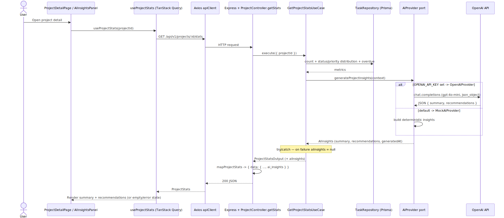

# Task Management

API REST (Node + Express + TypeScript sobre PostgreSQL) y dashboard en React 18 para gestionar proyectos y tareas, con insights asistidos por IA — todo se levanta con un solo `docker compose up`.


---

## Quick Start

**1. Requisitos previos**

- **Git** — para clonar el repositorio.
- **Docker** (incluye Docker Compose) — ejecuta toda la aplicación.
- **Node 22** y **pnpm** — solo para tests, lint y scripts fuera de Docker. Node 22 está fijado por Docker y `.nvmrc`; mínimo soportado por el toolchain: **Node 20.19+**.

**2. Configuración**

Copia las variables de entorno de ejemplo a `.env` (Postgres, puertos, CORS) con valores listos para desarrollo.

**Linux / macOS / Git Bash / PowerShell:**
```bash
cp .env.example .env
```

**Windows (CMD):**
```cmd
copy .env.example .env
```

**3. Arranque**

```bash
docker compose up
```

Un solo comando deja el sistema listo, sin pasos manuales de Prisma. Automáticamente:

- PostgreSQL inicia.
- El backend inicia.
- El frontend inicia.
- Las migraciones Prisma se aplican (`prisma migrate deploy`).
- El seed se ejecuta **solo si la base está vacía**.

> El **primer arranque** puede tardar algo más: Docker descarga las imágenes y construye los contenedores. Los arranques siguientes son mucho más rápidos.

**4. Acceso a la aplicación**

Una vez finalizado el arranque:

- Backend: `http://localhost:3000`
- Frontend: `http://localhost:5173`
- API docs (Swagger): `http://localhost:3000/api/docs`

Comprobación rápida: abre `http://localhost:5173` — el dashboard debe mostrar datos y la vista de **Proyectos** debe listar los proyectos demo activos. Si aparecen, el seed se cargó correctamente.

**5. Datos demo**

En el primer arranque (base vacía), el seed crea **3 proyectos demo** — **2 activos** y **1 archivado** — cada uno con sus tareas asociadas.

**6. Reinicios posteriores**

- Las migraciones son **idempotentes** (no-op si ya están aplicadas).
- El seed **no vuelve a ejecutarse**.
- Los datos existentes **se conservan**.

---

## Stack y criterio de selección

### Backend

| Tecnología | Versión | Por qué |
|---|---|---|
| Node.js | 22 LTS | Runtime estandarizado del proyecto (imagen Docker y `.nvmrc`); LTS con soporte amplio. |
| TypeScript | 5.x | Type-safety de extremo a extremo, del esquema a la UI. |
| Express | 4.x | Capa HTTP mínima y sin opiniones; mantiene el dominio libre de framework. |
| Prisma | 5.x | Schema como fuente de verdad; type-safety automático sin decorators. |
| PostgreSQL | 15 | Integridad relacional, enums nativos y `TIMESTAMPTZ` con zona horaria. |
| Zod | 3.x | Validación en runtime que infiere los tipos de TypeScript (una sola fuente para la forma de los datos). |
| Pino | 8.x | Logging estructurado en JSON con muy bajo overhead. |
| Helmet | 7.x | Cabeceras HTTP seguras por defecto. |
| express-rate-limit | 7.x | Protección contra abuso en endpoints públicos y de escritura. |
| Jest + Supertest | 30.x / 7.x | Tests de use cases sin base de datos y del ciclo HTTP completo. |
| swagger-jsdoc + swagger-ui-express | 6.x / 5.x | Contrato de la API servido en vivo desde el código. |

### Frontend

| Tecnología | Versión | Por qué |
|---|---|---|
| React | 18.x | Modelo de componentes y concurrencia. |
| Vite | 5.x | Dev server y build rápidos. |
| React Router | 7.x | Routing declarativo del SPA. |
| TanStack Query | 5.x | Server state: cache, loading, error e invalidación sin `useEffect`. |
| Zustand | 5.x | UI state (filtros, sidebar, modo de vista) separado del server state. |
| React Hook Form + Zod | 7.x / 3.x | Formularios performantes con validación que comparte esquema con el backend. |
| shadcn/ui + Tailwind CSS | — / 3.x | Componentes accesibles y CSS utilitario sin librería pesada de UI. (shadcn/ui no se versiona: son componentes generados por CLI y copiados al repo.) |
| Axios | 1.x | Cliente HTTP único y configurado en un solo lugar. |
| Vitest + RTL + MSW | 2.x / 16.x / 2.x | Tests de componentes con la API mockeada en red. |

### Infraestructura

| Tecnología | Por qué |
|---|---|
| Docker | Entorno reproducible que el evaluador levanta con un solo comando, sin instalar dependencias locales ni configurar servicios manualmente. |
| pnpm workspaces | Monorepo con dependencias compartidas y builds por workspace. |

---

## General System Flow

Qué hace el sistema y cómo fluye la información: las acciones que puede realizar un usuario y cómo se conectan frontend, backend, base de datos e IA.



---

## Arquitectura

### Backend — Clean Architecture (dependencias hacia adentro)

```
┌──────────────────────────────────────────────────────────────┐
│ Presentation   routers · controllers · middlewares · validators│
│ Application    use cases · DTOs                                 │
│ Domain         entidades · value objects · interfaces · errores │
│ Infrastructure repositorios Prisma · AI providers · logger      │
└──────────────────────────────────────────────────────────────┘
   Presentation → Application → Domain ← Infrastructure
```

Reglas no negociables: `domain/` no importa nada externo (ni Prisma ni Express); `application/` depende solo de `domain/`; `infrastructure/` implementa interfaces de `domain/`; `main.ts` es el **único** composition root que conoce a la vez `infrastructure/` y `application/`. Esto permite testear los use cases sin base de datos.

### Frontend — feature-based (slices verticales)

```
features/  projects · tasks · dashboard   (cada uno con api/ · components/ · hooks/)
shared/    ui (shadcn) · lib (axios, query-client) · stores (zustand) · hooks · types
app/       router · providers · layout
```

Los features no comparten componentes ni estado interno entre sí; la única dependencia cruzada permitida es consumir el hook de datos (TanStack Query) de otro feature o lo que viva en `shared/` — por ejemplo, el dashboard consume `useProjects` del feature `projects`. Cada componente que hace fetch implementa los cuatro estados async: loading, error (con retry), empty (con CTA) y data.

### Detalles operativos relevantes

- **Orden de registro de middlewares** (en `main.ts`):

  ```
  1. Helmet   2. Correlation ID   3. CORS   4. express.json()
  5. Request Logger   6. Rate Limiter   7. Routes   8. 404   9. Error Handler
  ```

  El Correlation ID va en posición 2 a propósito: así el `correlationId` está disponible en **todos** los logs desde el inicio de la request.

- **Dos limitadores de tasa con responsabilidades distintas:** `globalRateLimiter` se aplica en `main.ts` antes de todas las rutas; `writeLimiter`, más estricto, se aplica dentro de cada router solo en las rutas de escritura (POST/PUT/PATCH/DELETE).

---

## Base de datos

Esquema relacional (PostgreSQL 15) derivado de `apps/backend/prisma/schema.prisma`:



- **Relación:** un `projects` tiene 0..N `tasks`; la FK `tasks.project_id → projects.id` usa `ON DELETE CASCADE`.
- **Claves primarias:** UUID generadas por `gen_random_uuid()`.
- **Enums:** `ProjectStatus` (ACTIVE, ARCHIVED) · `TaskStatus` (TODO, IN_PROGRESS, IN_REVIEW, DONE, CANCELLED) · `Priority` (LOW, MEDIUM, HIGH, CRITICAL).
- **Índices en `tasks`:** `project_id`, `status`, `priority`, `due_date` y el compuesto `(project_id, status)`.

---

## AI Insights

El detalle de proyecto muestra insights generados sobre las métricas del proyecto. Flujo real, de la UI a OpenAI:



- **Entrada UI:** `AIInsightsPanel` (renderizado en `ProjectDetailPage`) usa el hook `useProjectStats` → `GET /api/v1/projects/:id/stats`.
- **Backend:** `GetProjectStatsUseCase` calcula las métricas y llama a la interfaz de dominio `AIProvider.generateProjectInsights(context)`.
- **Provider:** se resuelve en el composition root (`main.ts`) — `OpenAIProvider` (modelo `gpt-4o-mini`) cuando `OPENAI_API_KEY` está presente, o `MockAIProvider` por defecto.
- **Tolerancia a fallos:** si el provider falla, el use case deja `aiInsights` en `null` (try/catch) y el panel muestra el estado "no disponible".

---

## Estructura del proyecto

```
task-management/
├── apps/
│   ├── backend/                 API REST (Clean Architecture)
│   │   ├── prisma/              schema, migraciones y seed
│   │   ├── docker-entrypoint.sh migrate deploy + seed condicional, luego arranca el server
│   │   └── src/
│   │       ├── domain/          entidades, value objects, interfaces de repositorio, errores
│   │       ├── application/     use cases + DTOs
│   │       ├── infrastructure/  repositorios Prisma, AI providers, logger
│   │       ├── presentation/    routers, controllers, middlewares, validators, docs Swagger
│   │       └── main.ts          composition root
│   └── frontend/                SPA React 18 (feature-based)
│       └── src/
│           ├── features/        projects · tasks · dashboard (slices verticales)
│           ├── shared/          ui, lib, stores, hooks, types
│           └── app/             router, providers, layout
├── packages/
│   └── shared/                  esquemas Zod + tipos TS compartidos entre backend y frontend
├── docker-compose.yml
└── .env.example
```

---

## Comandos disponibles

| Comando | Descripción |
|---|---|
| `docker compose up` | Levanta todo el sistema (migra y siembra automáticamente). |
| `pnpm test` | Corre todos los tests del monorepo. |
| `pnpm lint` | Linting del monorepo. |
| `cd apps/backend && pnpm db:seed` | Regenera los datos de demo (destructivo: borra y vuelve a sembrar). |
| `cd apps/backend && pnpm db:studio` | Abre Prisma Studio. |

**Variables de entorno.** Para levantar la app basta copiar `.env.example` a `.env` (lo usa Docker). Para correr los tests o el tooling de Prisma **en host** (fuera de Docker), copia primero las plantillas del backend.

**Linux / macOS / Git Bash / PowerShell:**
```bash
# Tests (BD de test separada en localhost):
cp apps/backend/.env.test.example apps/backend/.env.test
pnpm test

# Tooling de Prisma en host (db:studio, db:migrate, db:seed):
cp apps/backend/.env.example apps/backend/.env
```

**Windows (CMD):**
```cmd
copy apps\backend\.env.test.example apps\backend\.env.test
pnpm test

copy apps\backend\.env.example apps\backend\.env
```

---

## Decisiones arquitectónicas principales

- **Clean Architecture en Express:** el dominio no conoce Prisma ni Express, por lo que los use cases se testean sin base de datos; las dependencias apuntan siempre hacia adentro.
- **Prisma con el schema como fuente de verdad:** los tipos y los enums se derivan del esquema, y todo cambio de base pasa por migraciones versionadas (`migrate deploy` en el arranque).
- **TanStack Query para server state, Zustand para UI state:** categorías que no se solapan — el dato del servidor nunca vive en Zustand y el estado de UI nunca vive en la cache de Query.
- **AIProvider como puerto de dominio** (`domain/services/ai-provider.ts`): la lógica de negocio depende de una interfaz, no de un SDK; `MockAIProvider` y `OpenAIProvider` son detalles intercambiables resueltos en el composition root.
- **Observabilidad integrada:** Pino emite logs estructurados en JSON y cada request lleva un `correlationId` presente en todas sus entradas de log, lo que hace trazable cualquier petición de punta a punta.

---

## Decisiones no tomadas — y por qué

**Autenticación:** El sistema no implementa autenticación en esta iteración. La decisión fue explícita: implementar auth correctamente requiere tabla de usuarios, gestión de tokens JWT con refresh, políticas de acceso por recurso y validación en cada endpoint — scope que no aporta valor diferencial en una prueba técnica de tres días. La arquitectura está preparada: agregar `userId` a `projects` y `tasks`, implementar middleware JWT, y aplicar RLS en PostgreSQL es el path natural sin reestructurar nada.

**Real-time:** Las actualizaciones en tiempo real (WebSockets o SSE) no están implementadas. El `useUpdateTaskStatus` con optimistic updates cubre el 80% del valor percibido de real-time para la mayoría de los casos de uso. SSE sería la evolución natural para notificaciones de cambios de otros usuarios.

**Integración LLM en producción:** Los insights que muestra el `AIInsightsPanel` provienen del `MockAIProvider` por defecto. El `OpenAIProvider` (`apps/backend/src/infrastructure/ai/openai-ai.provider.ts`) está implementado y se activa con `OPENAI_API_KEY` — la abstracción demuestra el patrón sin generar costos en una prueba. La selección de provider ocurre en el composition root según la presencia de la variable de entorno.

---

## Guía para el evaluador

Todas las rutas citadas existen en un clon limpio del repositorio.

**Si tienes 15 minutos, lee en este orden:**

1. `apps/backend/src/domain/` — el núcleo sin dependencias externas (entidades, value objects, reglas de transición de estado).
2. `apps/backend/src/application/use-cases/tasks/update-task-status.use-case.ts` — transiciones de estado con lógica de dominio.
3. `apps/backend/src/infrastructure/ai/` — el patrón de abstracción del AI provider (puerto en `domain/services/ai-provider.ts`, implementaciones mock y OpenAI aquí).
4. `apps/frontend/src/features/dashboard/components/AIInsightsPanel.tsx` — manejo de los estados async de las respuestas de IA.
5. `apps/backend/src/main.ts` — composition root: dónde se conecta todo y se registra el orden de middlewares.

**Si tienes 30 minutos adicionales:**

- `apps/backend/src/application/use-cases/**/*.spec.ts` — tests de use cases sin base de datos.
- `apps/backend/src/presentation/http/routes/*.integration.spec.ts` — tests de integración HTTP de los endpoints.
- `apps/frontend/src/features/dashboard/components/AIInsightsPanel.test.tsx` — tests de los cuatro estados async del componente de IA.
- `http://localhost:3000/api/docs` — el contrato completo de la API en Swagger.

---

## Evolución futura

Si esto fuera un producto real, el siguiente paso sería **autenticación y multi-tenant**: una tabla de usuarios, JWT con refresh y aislamiento por `userId` reforzado con Row-Level Security en PostgreSQL, de modo que cada usuario solo vea sus proyectos y tareas.

Después vendrían las **notificaciones en tiempo real con SSE**, para que los cambios de estado de tareas hechos por un usuario se reflejen en las pantallas de los demás sin recargar, complementando los optimistic updates ya existentes.

El procesamiento de IA se movería a un **worker asíncrono** (por ejemplo SQS + Lambda, o una cola tipo Bull): los insights se generarían fuera del ciclo de request y se entregarían cuando estén listos, eliminando la latencia del LLM del camino crítico de la API.

A más largo plazo, un enfoque de **RAG sobre el historial de tareas del proyecto** permitiría que los insights razonen sobre el contexto acumulado —tendencias, cuellos de botella recurrentes, estimaciones— en lugar de únicamente sobre el snapshot actual.
